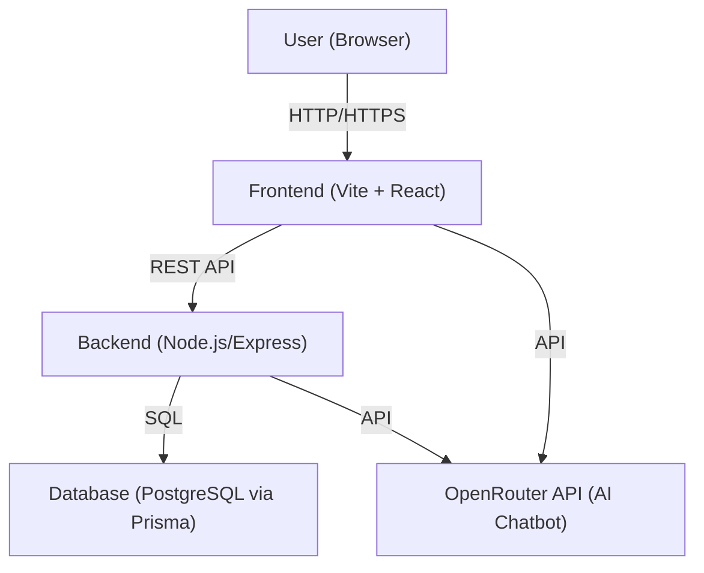

# MedWise Healthcare
A full-stack healthcare web application featuring user authentication, medication management, AI-powered chat, health tracking, emergency tools, and more.

currently deployed at https://medwiser-beta.vercel.app/


---

## Features
- User Authentication (login/signup)
- Admin Dashboard for user management
- AI Medical Chatbot (OpenRouter API)
- Medication Management (add, edit, reminders)
- Health Metrics Tracking (weight, BMI, etc.)
- Disease Predictor (symptom-based)
- Prescription Scanner (OCR)
- Emergency Tools (location, contacts)
- Mental Health Tools
- Responsive UI with accessibility features

---

## High-Level Design (HLD)

### System Architecture



- **Frontend**: React app (Vite) handles UI, state, and API calls.
- **Backend**: Node.js/Express REST API, handles business logic, authentication, and DB access.
- **Database**: PostgreSQL, accessed via Prisma ORM.
- **External API**: OpenRouter for AI chatbot.

---

## Low-Level Design (LLD)

### Key Modules & Responsibilities

#### Frontend
- `src/pages/` — Main app pages (Login, Dashboard, Chat, Medications, Health, Profile, etc.)
- `src/components/` — Reusable UI components (modals, spinners, toasts, etc.)
- `src/store/` — Zustand state management
- `src/hooks/` — Custom React hooks
- `src/utils/` — Utility functions (validation, performance, accessibility)

#### Backend
- `backend/src/` — Express app entry and route handlers
- `backend/prisma/` — Prisma schema and migrations
- `backend/.env` — Backend environment variables (DB connection, secrets)

### Example Data Flow: User Login
1. User submits login form in frontend (`src/pages/Login.tsx`).
2. Frontend sends POST request to `/auth/login` on backend.
3. Backend validates credentials, queries DB via Prisma, returns JWT token.
4. Frontend stores token and updates UI state.

### Example Data Flow: Chatbot
1. User sends message in Chat page (`src/pages/Chat.tsx`).
2. Frontend calls OpenRouter API directly (or via backend if needed) using API key from env.
3. Response is displayed in chat UI.

### Example API Endpoints
- `POST /auth/login` — User login
- `POST /auth/signup` — User registration
- `GET /medications` — List medications
- `POST /medications` — Add medication
- `GET /health-metrics` — List health metrics
- `POST /health-metrics` — Add health metric
- `GET /admin/users` — Admin: list users

---

## Project Structure

```
project-root/
  backend/                # Node.js/Express/Prisma backend
    src/
    prisma/
    package.json
    ...
  src/                    # React + Vite frontend
    pages/
    components/
    hooks/
    store/
    ...
  public/
  .env                    # Environment variables (not committed)
  package.json            # Frontend dependencies/scripts
  ...
```

---

## Getting Started

### Prerequisites
- Node.js (v18+ recommended)
- npm

### 1. Clone the Repository
```sh
git clone https://github.com/yourusername/medwise-healthcare.git
cd medwise-healthcare
```

### 2. Setup Environment Variables
Create a `.env` file in the project root:
```
VITE_BACKEND_URL=https://your-backend-url.onrender.com
VITE_OPENROUTER_API_KEY=your-openrouter-api-key
```
For backend, set up a `.env` in `backend/`:
```
DATABASE_URL=your-database-connection-string
# Add other backend secrets as needed
```

### 3. Install Dependencies
#### Frontend
```sh
npm install
```
#### Backend
```sh
cd backend
npm install
```

### 4. Run Locally
#### Backend
```sh
cd backend
npm run dev
```
#### Frontend
```sh
npm run dev
```
Visit [http://localhost:5173](http://localhost:5173) in your browser.

---

## Deployment

### Frontend
- **Vercel** (recommended): Import your repo, set environment variables, and deploy.
- **Netlify**: Import repo, set build command to `npm run build`, publish directory to `dist`, and set environment variables.

### Backend
- **Render.com**: Deploy as a web service, set environment variables in the dashboard.

---

## Tech Stack
- **Frontend:** React, Vite, Zustand, TailwindCSS, Framer Motion, Recharts, Tesseract.js, Lucide React
- **Backend:** Node.js, Express, Prisma, PostgreSQL (or your DB)
- **Testing:** Vitest, Testing Library
- **Deployment:** Vercel (frontend), Render.com (backend)

---

## Security
- All secrets and API keys are stored in environment variables and are **not** committed to git.
- Review `.gitignore` to ensure `.env` and sensitive files are excluded.
- Rotate API keys if you suspect exposure.

---

## License
[MIT](LICENSE) (or your chosen license)

---

**For more details on backend structure and development, see `backend/README.md`.** 
